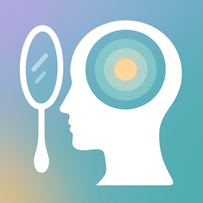

#  MirrorNotes

> *Discover yourself through the patterns in your thoughts*

  

MirrorNotes is an introspective iOS journaling app that uses AI to help you understand yourself better through a progressive reflection system.

## How It Works

MirrorNotes creates a journey of self-discovery through four interconnected layers:

### Notes → Memories → Beliefs → Sense of Self

1. **Notes**: Write your thoughts, experiences, or quotes. AI analyzes each note for themes and emotional tone.

2. **Memories**: When themes appear across multiple notes, generate memories that capture patterns in your thinking.

3. **Beliefs**: As memories accumulate, form beliefs about your values and character.

4. **Sense of Self**: Discover a synthesized identity statement based on your accumulated beliefs.

## Key Features

- **Smart Note Analysis**: AI automatically identifies themes and emotional patterns
- **Theme Cloud Visualization**: Interactive view of your thought patterns
- **Progressive Insights**: Each layer builds deeper understanding

## Reporting Issues

This repository is for tracking bugs, feature requests, and general feedback for MirrorNotes.

### Before Submitting an Issue

1. Check if a similar issue already exists
2. Include your iOS version and device model
3. Provide clear steps to reproduce bugs
4. Add screenshots when relevant

## Links

- [Support](mailto:support@mirrornotes.app)

---

MirrorNotes - *Reflect. Discover. Become.*
